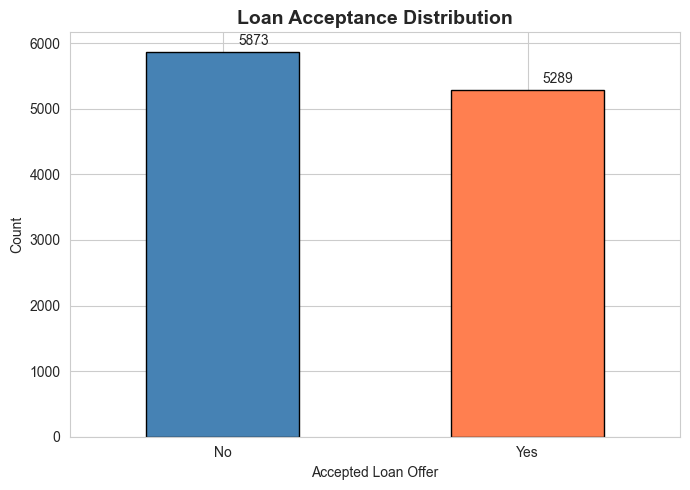
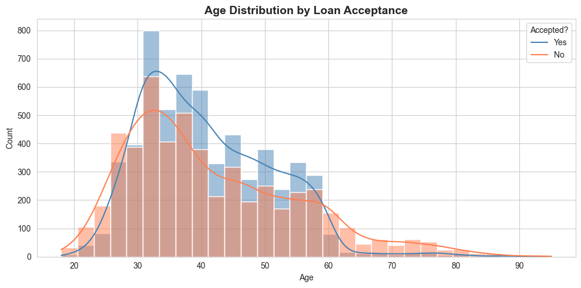
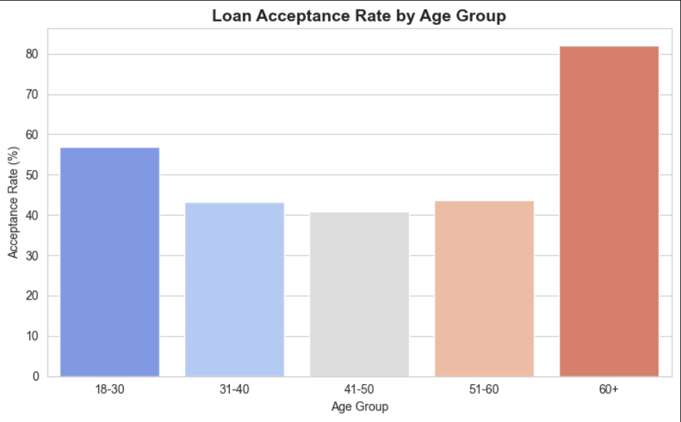
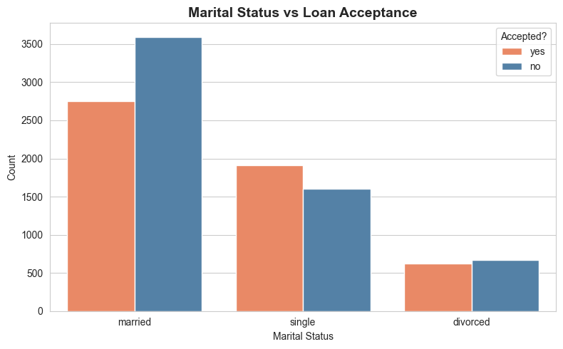
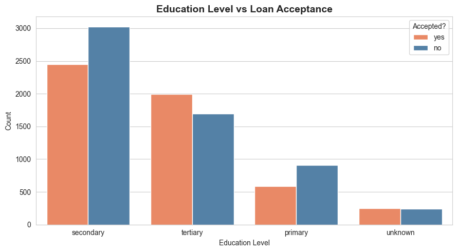
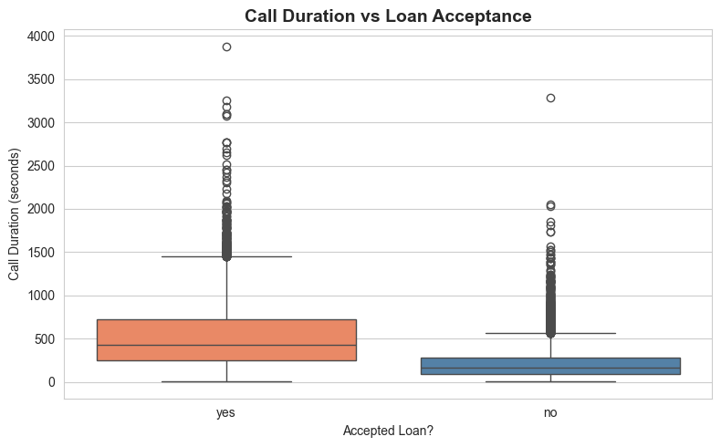
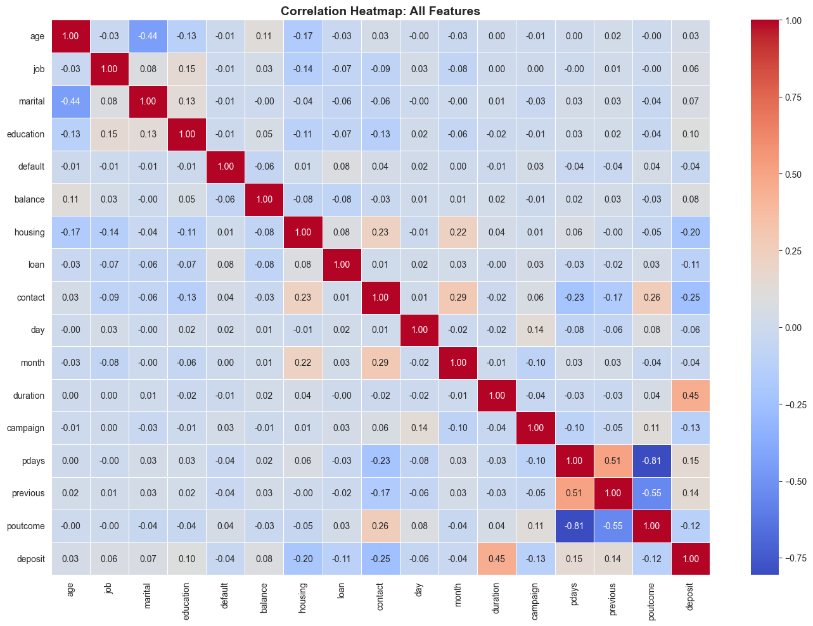
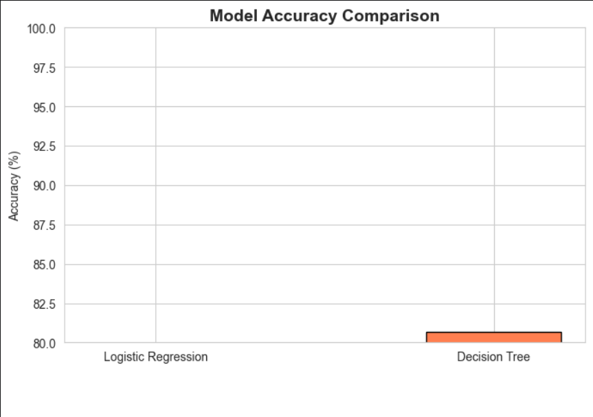
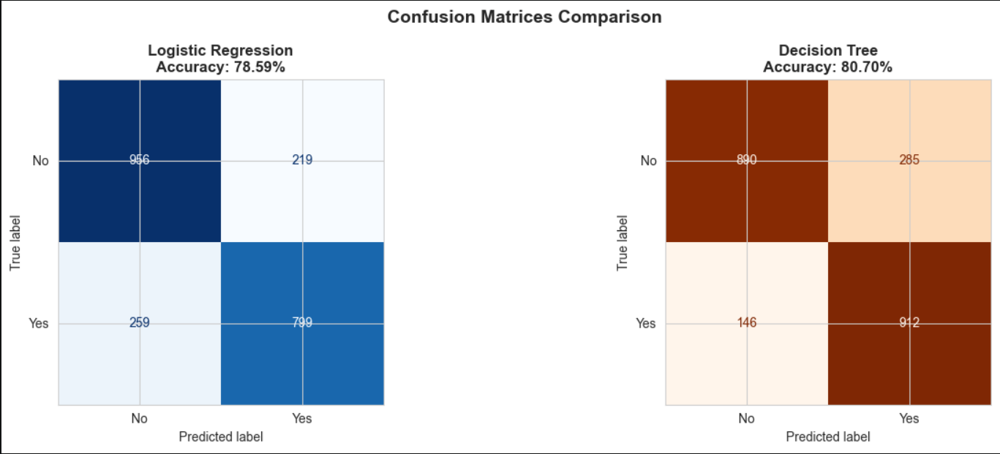
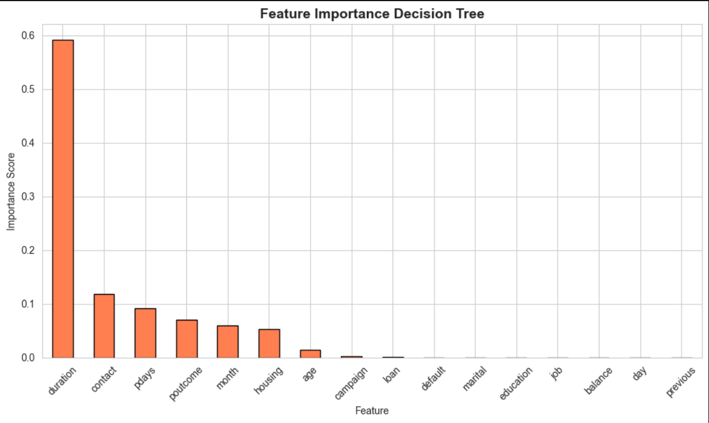

# Personal Loan Acceptance Prediction

Banks run marketing campaigns by calling thousands of customers to offer loan products. Most of those calls go nowhere. The cost of reaching the wrong people adds up fast, and the conversion rate on untargeted campaigns is low enough that the economics barely work. This project builds a model to predict which customers are actually likely to say yes, so the bank can focus its calls where they have a real chance of converting.

---

## The Problem

Out of 45,162 customers in this dataset, 5,289 accepted the loan offer and 5,873 did not. That is an acceptance rate of just under 47%, but the dataset comes from a real Portuguese bank campaign where the original acceptance rate was much lower. The goal was to find the pattern behind who says yes.

---

## The Data

**Source:** Bank Marketing Dataset, UCI Machine Learning Repository via Kaggle
**Size:** 45,211 customer records, 17 features
**Target variable:** deposit. yes if the customer accepted the loan offer, no if they did not.

Features included age, job type, marital status, education, account balance, housing loan status, call duration, number of campaign contacts, days since last contact, and outcome of the previous campaign.

---

## What I Did

**1. Cleaned the data**
Checked for missing values and duplicates. Applied label encoding to all categorical variables and used stratified sampling on the 80/20 train-test split to preserve class balance.

**2. Explored the data**
Before modeling I wanted to understand who was actually accepting these offers.

The age distribution showed that acceptances were spread across all age groups, but the acceptance rate chart told a more interesting story. Customers aged 60 and above accepted at 81%, by far the highest of any group. The 18 to 30 group came in second at 57%. The middle age groups, 31 to 60, were the hardest to convert.

Students and retired customers had the highest acceptance rates by job type at 74% and 66% respectively. Blue collar workers were the least responsive at 36%.

Single customers accepted at a higher rate than married ones. Married customers made up the largest group in both yes and no categories but their acceptance rate was lower proportionally.

Tertiary educated customers accepted at a higher rate than primary or secondary educated ones, though the difference was not dramatic.

The single most striking finding from EDA was call duration. Customers who accepted stayed on the call significantly longer. The median call duration for acceptances was more than double that of rejections.

The correlation heatmap confirmed duration as the strongest single predictor of deposit at 0.45. Everything else was weak in isolation.

**3. Trained two models**
I trained Logistic Regression with max_iter set to 1000 and a Decision Tree with max_depth set to 5, both with a fixed random state for reproducibility.

**4. Evaluated the models**
Both models were assessed on accuracy and confusion matrices.

---

## Results

| Model | Accuracy |
|---|---|
| Logistic Regression | 78.59% |
| **Decision Tree** | **80.70%** |

Decision Tree outperformed Logistic Regression and also provided interpretable feature importance scores, making it more useful for business decisions.

The confusion matrices show that Logistic Regression correctly identified 799 acceptances and 956 rejections. The Decision Tree correctly identified 912 acceptances and 890 rejections. The Decision Tree caught significantly more true acceptances, which matters more in a campaign context where missing a likely yes is the expensive mistake.

Call duration dominated the Decision Tree's feature importance at 0.59, with contact method second at 0.12. Demographics like job, education, and balance contributed almost nothing individually.

---

## What the Model Tells the Bank

Three things stand out from this analysis that a campaign manager could act on immediately.

Call duration is not just a predictor, it is a lever. Customers who stay on the call longer are more likely to say yes. Training call agents to extend conversations rather than pitch quickly and hang up would likely improve conversion rates.

The highest value segments to target are customers aged 60 and above, students, and retired customers. These three groups consistently accepted at rates well above the dataset average.

Customers with a positive outcome from a previous campaign were far more likely to accept again. Re-engaging past converters before cold outreach to new customers is the lowest cost path to higher conversion.

---

## Tech Stack

Python, pandas, NumPy, scikit-learn, matplotlib, seaborn

---

## Author

**Aiman Ishaq**
CS Student | Data Analyst Intern, Developers Hub Corporation
[LinkedIn](https://linkedin.com/in/aiman-ishaq) . [GitHub](https://github.com/aiman-ami)
